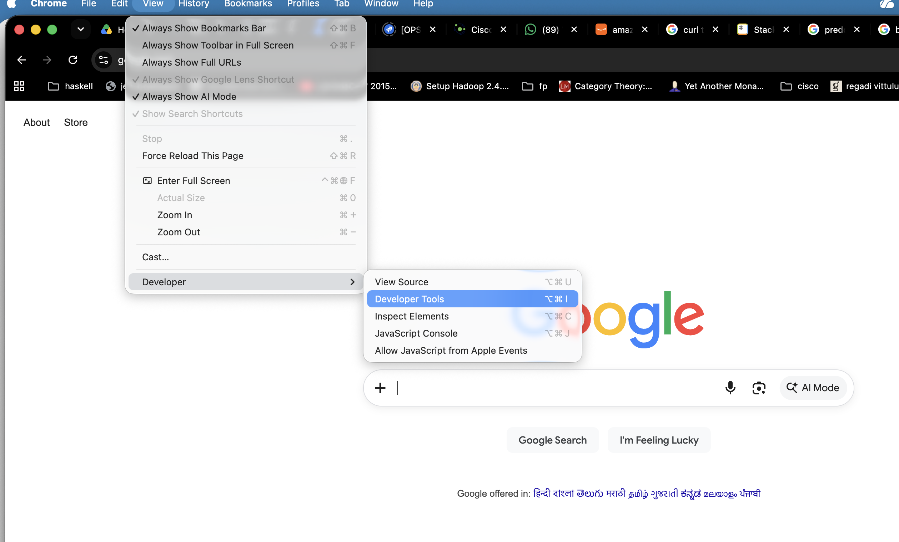
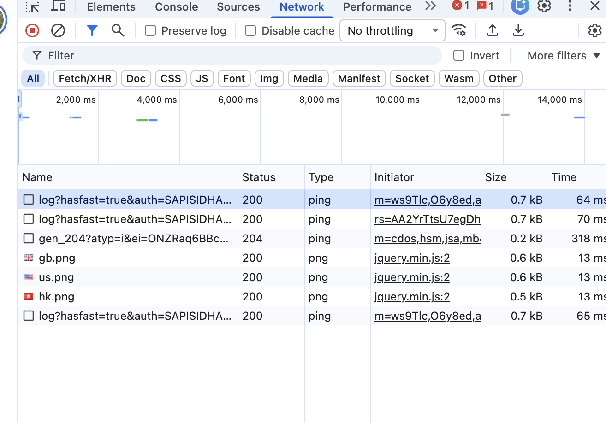

# What is curl
Networking is full of application layer protocols and for each protocol there is a interface to interact. HTTP and HTTPS famous protocols interface is browser like Chrome/Safari/firefox. Curl is command line interface and can communicate many protocols, predominantly used for http/https.

## Installation
On Mac systems install via brew.

    brew update && brew install curl
Linux systems might have already curl or use yum or apt to install curl.

## Usage of Curl
Http has several methods, two mostly used are GET and POST. If you are using a browser and type URL it is get request, if you fill form and submit mostly it is post request. 

Let us start basic usage of curl
You open browser and fire a site say stackedit.io, if you wanted to do same with curl

    curl stackedit.io
You would like to save this to a page instead of standard output

    curl -o stackpage.html stackedit.io
The above requests are GET requests. We can add GET in the command line, though default is always GET

    curl -X GET http://stackedit.io

-X GET is not requried to provide, as it is default.

## Return codes

HTTP protocol specifies return values of each request. We don't see them in browser if not 404 or page not found or 500 where some issue on server side. 
HTTP status codes are three-digit numbers servers generate in response to a client (e.g., a browser) request. They indicate whether the request was completed successfully.

For example, a 404 error is a common HTTP status code you might have seen.

 1. 1xx InformationalRequest received, continuing process.
 2. 2xx SuccessAction successfully received, understood, and accepted.
 3. 3xx RedirectionFurther action must be taken to complete the request.
 4. 4xx Client ErrorThe request contains bad syntax or cannot be fulfilled.
 5. 5xx Server ErrorThe server failed to fulfill an apparently valid request.

Detail list of values further breaking can be found in this page. 
[Link to http return codes. ](https://www.semrush.com/blog/http-status-codes/)

## Return codes checking
Let us first go through how to check return codes in Chrome browser (It may vary for other browsers).
View -> Developer -> Developer Tools

You can see status code here


We will use curl to get headers of the request, not data.

     curl -I www.google.com

``` HTTP/1.1 200 OK
Content-Type: text/html; charset=ISO-8859-1
Content-Security-Policy-Report-Only: object-src 'none';base-uri 'self';script-src 'nonce-yD-MHicI35UVORQ0lUbwFA' 'strict-dynamic' 'report-sample' 'unsafe-eval' 'unsafe-inline' https: http:;report-uri https://csp.withgoogle.com/csp/gws/other-hp
P3P: CP="This is not a P3P policy! See g.co/p3phelp for more info."
Date: Sat, 11 Jul 2026 05:48:20 GMT
Server: gws
X-XSS-Protection: 0
X-Frame-Options: SAMEORIGIN
Expires: Sat, 11 Jul 2026 05:48:20 GMT
Cache-Control: private
Set-Cookie: __Secure-STRP=ANmZwa0B_UC6DTznQkvY_Hq26YQW3inNM9Ms9ZSPyUDqpVZAKHi3-c1M94mXJm0w-0pnkWHfeb4xP8p2zrgtRf5pVfVhvu3fhMk-; expires=Sat, 11-Jul-2026 05:53:20 GMT; path=/; domain=.google.com; Secure; SameSite=strict
Set-Cookie: AEC=AdJVEatIbOS1lJHBTaF2vFwBdpQVbWREA2wW0HtGciq3ThWIeG95HwWlYA; expires=Thu, 07-Jan-2027 05:48:20 GMT; path=/; domain=.google.com; Secure; HttpOnly; SameSite=lax
Set-Cookie: NID=532=TO8Rhm31atlkRx0N3fE2fDaHmYhCzHUfWehcTVto1SXdcN9MKrbJEPllbzPQuuwTRY-d5DeJejep1Lty295hO3M0658KtVj7TeCq4w0MGK5iJ9bXyBHsCZaPDBOO7MsgoguQcavZWMGOZrx9vGP-5GZRMc378gFYeukvMfGRw-R2cQMntzhC3zkEqqEE4O_vstBDcgBZf5aWOsJFs7Q; expires=Sun, 10-Jan-2027 05:48:20 GMT; path=/; domain=.google.com; HttpOnly
Transfer-Encoding: chunked ```

Exercise. Go through each of these and try to understand about http protocol.

Another interesting option is using -v.

    curl -v http://www.google.co.in/
-v gives detailed requested information.

How to do curl redirect method (-L) or https (via -k) will be covered.

Curl can send post request 
    curl -d 'name=admin&shoesize=12' http://example.com/
    
## Learn from doing
Http, Https can be learned by doing curl.
Go through the points listed in `https://everything.curl.dev/` Command line concepts, command line transfers and http sections.


